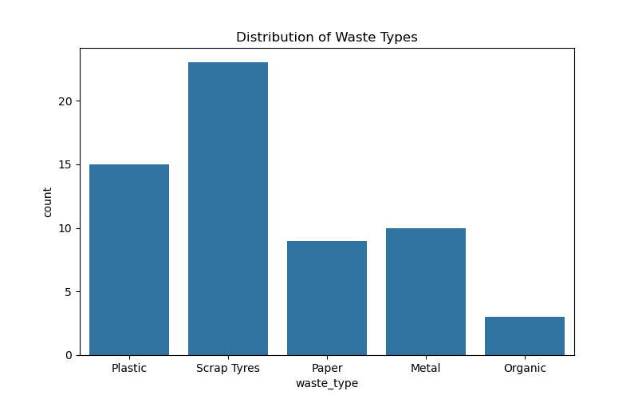
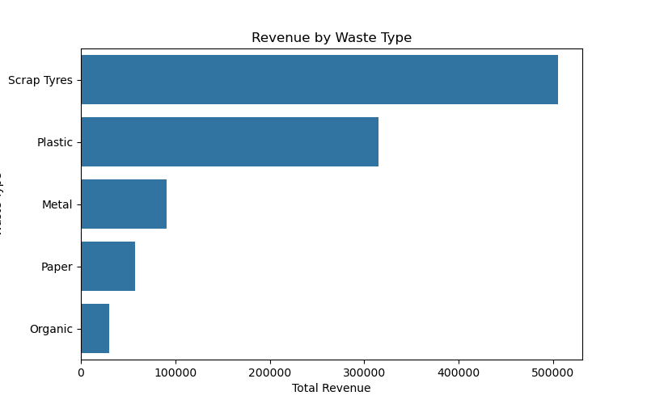
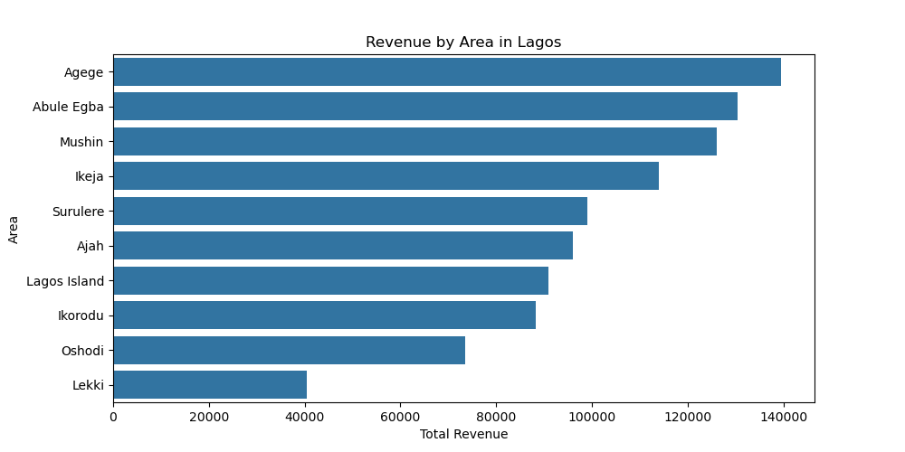
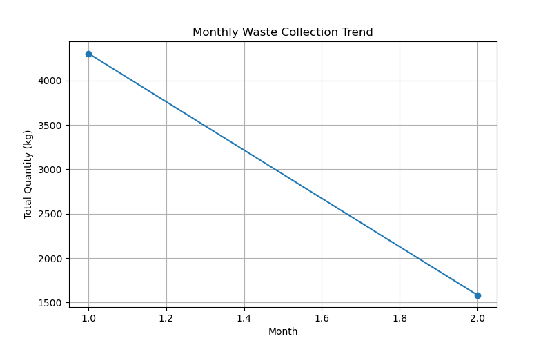
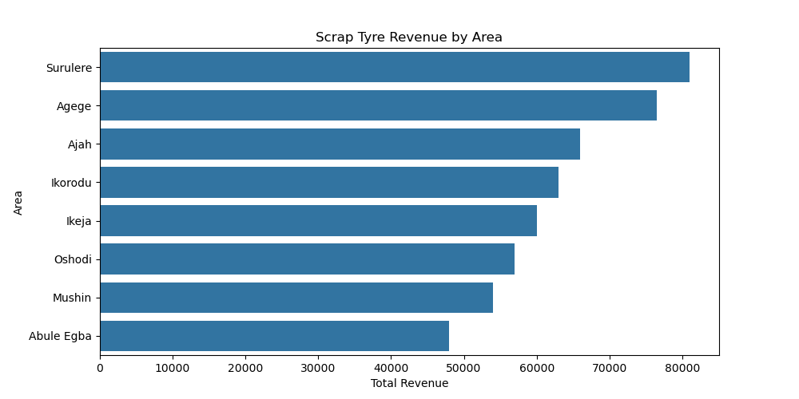

# Recycling Waste Analysis & Profitability in Lagos ♻️

## 📌 Overview

This project analyzes recycling waste data across different areas in Lagos, Nigeria. The goal is to understand waste distribution, revenue generation, and identify opportunities to improve recycling efficiency and profitability.

The analysis focuses on key waste types, area performance, and trends over time, with special attention given to scrap tyre recycling.

---

## 🎯 Objectives

- Analyze the distribution of different waste types  
- Identify the most profitable recyclable materials  
- Evaluate recycling performance across Lagos areas  
- Examine trends in waste collection over time  
- Assess the impact of scrap tyres on revenue and operations  

---

## 📊 Dataset Description

The dataset contains simulated recycling data based on real-world scenarios in Lagos.

**Features:**
- Date – Waste collection date  
- Area – Location within Lagos  
- Waste Type – Type of recyclable material (Plastic, Metal, Paper, Glass, Organic, Scrap Tyres)  
- Quantity (kg) – Amount of waste collected  
- Price per kg – Market price per material  
- Total Revenue – Revenue generated  

---

## 🛠 Tools & Technologies

- Python  
- Pandas  
- Matplotlib  
- Seaborn  

---

## 📈 Key Analysis Performed

- Waste type distribution  
- Revenue analysis by waste type  
- Area-based revenue analysis  
- Monthly trend analysis  
- Scrap tyre-specific analysis  

---

## 🔍 Key Insights

- Plastic and scrap tyres are among the most commonly collected waste types  
- Scrap tyres and metals generate the highest revenue  
- Recycling performance varies across different areas in Lagos  
- Waste collection shows variation over time, indicating trends  
- Scrap tyre recycling presents strong economic and environmental value  

---

## ♻️ Project Significance

This project demonstrates how data analysis can support better decision-making in recycling operations. It highlights both environmental impact and business opportunities within waste management in Lagos.

---

## 📁 Project Structure

recycling-analysis/
│
├── recycling_data.csv
├── recycling_waste_analysis.ipynb
└── README.md
## 📊 Project Visualizations

### Waste Distribution

### Revenue by Waste Type

### Revenue by Area

### Trend Over Time

### Scrap Tyres Analysis
